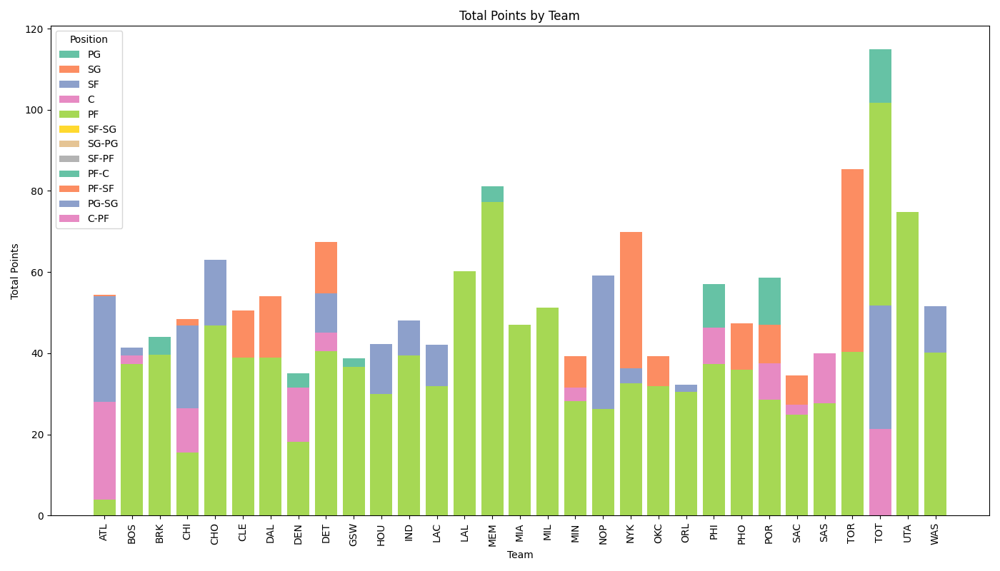
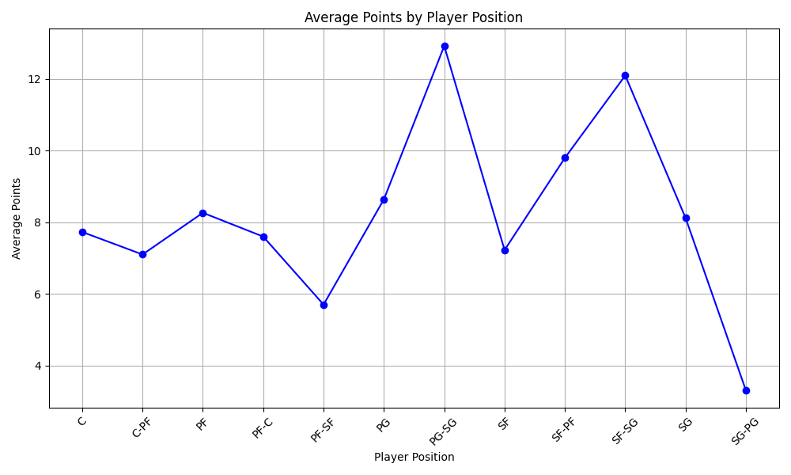

# Vishesh_Gupta_IDS706_Week3
[](https://github.com/nogibjj/Vishesh_Gupta_IDS706_Week3/actions/workflows/CI.yml)

## Overview
This repository contains my work for **Week 3** of the IDS706 course, where the purpose of this project is to transform the previous project (Pandas descriptive statistics) into generating descriptive statistics on datasets using Polars.

## File Structure 
```
Vishesh_Gupta_Individual_Project_1/
├── .devcontainer/
│   ├── devcontainer.json
│   └── Dockerfile
├── .github/
│   ├── workflows/CI.yml
├── .gitignore
├── Makefile
├── main_python.py             # Main Python script for data analysis
├── main_python_jp.ipynb        # Jupyter Notebook version of the analysis
├── pandas_main_python.py       # Alternative analysis using Pandas
├── test_main.py                # Test cases for validating the code
├── requirements.txt            # List of required packages for the project
├── 2023-2024 NBA Player Stats - Regular.csv  # Dataset used for analysis
├── bar_graph.png               # Bar graph visualization of NBA player stats
├── line_graph.png              # Line graph of trends in NBA player stats
```

## Data Visualisation 




## Repository Structure
```plaintext
├── main_python.py             # Main Python script for data analysis
├── main_python_jp.ipynb        # Jupyter Notebook version of the analysis
├── pandas_main_python.py       # Alternative analysis using Pandas
├── test_main.py                # Test cases for validating the code
├── requirements.txt            # List of required packages for the project
├── 2023-2024 NBA Player Stats - Regular.csv  # Dataset used for analysis
├── bar_graph.png               # Bar graph visualization of NBA player stats
├── line_graph.png              # Line graph of trends in NBA player stats
